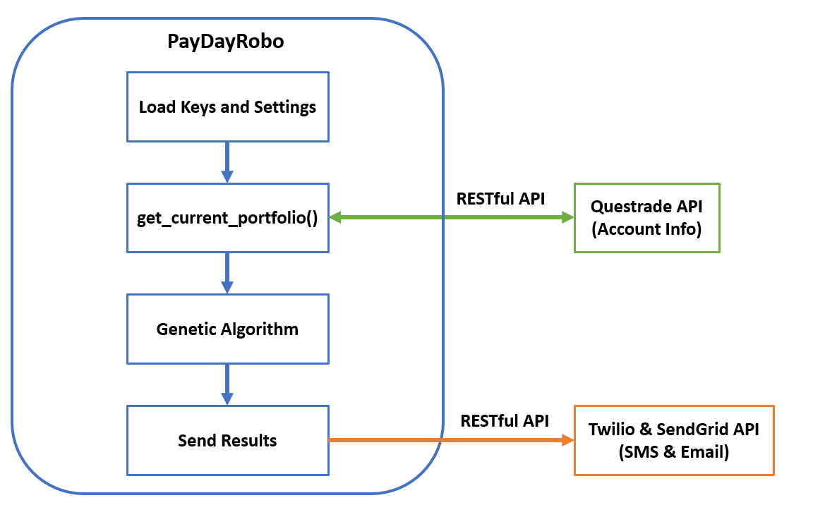

# PayDayRobo

## Inspiration
There are many popular tools around to help people contribute to their passive investment, i.e. Passiv, but there is no tool around (that I know of) that helps people manage their investment withdrawal. Thus, the goal of this project is to help the retired populations to manage their assets.

**[(HackED 2021 Project)](https://devpost.com/software/paydayrobo). This project won the Best use of Google Cloud award!**

## What it does
This program retrieves the account data from Questrade, then calculate the number of ETF/ stock shares to sell while maintaining the pre-defined portfolio allocation, withdrawal goal, and minimize the commission fees. These optimizations are achieved through a genetic algorithm. The resulting solution is then sent through either SMS, email, or both.

## How we built it
This project is built using Python with ❤️
## Dependencies:
  - sendgrid
  - qtrade
  - twilio
  - pyeasyga

## Deployment (as a cron job):
1. open the crontab: crontab -e
2. add an entry so it runs on the first day of every month:

  0 12 1 * * /full_path/PayDayRobo/script.py

3. save the crontab file

## Accomplishments that we're proud of:
Got the script working!
### Goals:
1. - [x] Communicate Questrade API
2. - [x] Minimize the portfolio allocation error using genetic algorithm  
3. - [x] Send the result via SMS
4. - [x] Setup my domain with
5. - [x] Send the result via email
6. - [x] Deploy the project as a cron job in a VM on Google Cloud
7. - [x] Make the Email Beautiful (HTML) (stretch goal)
8. - [ ] Dockerize the project (stretch goal)
9. - [ ] Deploy the project in some sort of
Kubernetes compute service (stretch goal)
10. - [ ] Incorporate some sort of adjusted cost base (ACB) calculation at the beginning of each year for income tax purpose (stretch goal)

## Flowchart

## Notification Sample
SMS:

Email:

(The BEE project from MailUp was used to generate the Email design)

## License
My work is released under the [MIT license](LICENSE)
